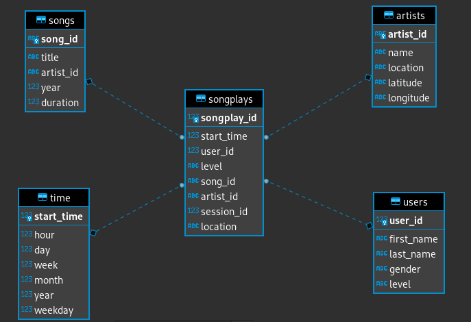

# Sparkify Data Modelling on a RDBMS

# About the Project

This project is a Proof of Concept of a data modelling process built using PostgreSQL. The overall idea of the project is to gather collected data from the [million song dataset](http://millionsongdataset.com/) and gather it up with data generated by running [this](https://github.com/Interana/eventsim) event simulator. 

The goal is to simply to fullfil the hypothetical analytics team's need of understanding what songs users are listening to. 

# The Structure 

The data is structured on the `/data` folders, song_data being the data from the dataset and log_data from the event generator. `etl.py` handles the ETL pipeline and populates the tables, as well as creating the songplay data, which follows the [Star schema](https://www.javatpoint.com/data-warehouse-what-is-star-schema). 


Here's an ER Diagram of the used tables:



# Using the code

In order to use the solution, make sure you have installed the latest version of PostgreSQL and Python as well as the following python packages: `psycopg2` and `pandas`.

For testing purposes, it is a good idea to set up an instance of a Jupiter Notebook server so you can use the notebooks presented in the code. The scripts can be run without any of the Notebooks, however, using them is a good and simpler way for testing the data line-by-line. 


Once this is done, create a student user following the same credentials on the etl files (though fell free to update them, if needed).

In the current structure, you can create and change the ETL process using a [notebook](etl.ipynb) , this is easier for testing and setting up the pipeline steps individually or modify them. Once that's done, you can update the [etl script](etl.py) so that it fetches and sets up all the data.

The other Python scripts are structured in a way that makes handling the database operations easier. `sql_queries.py`, for instances has the string for creating, dropping and inserting into the tables, as well as the query on song which is needed to be used. It was built as a module to be used by both `etl.py` and `create_tables.py`.

The `create_table.py` script can be used for the tables to be dropped and recreated, which is a good manner to reset the data for testing and fixing bugs, while being used alongside `etl.py` or `etl.ipynb`. 

# Running the scripts

After installing the dependencies, you can create the tables by running the following: 

```python create_tables.py``` 


Then you can run the ETL code by running:

```python etl.py```


# Testing the data

There's also a [test notebook](test.ipynb) in place for verifying that the data was properly validate the ETL pipeline.


This project is my solution to an assessment in Udacity's [Data Engineering Nano Degree](https://www.udacity.com/course/data-engineer-nanodegree--nd027)

